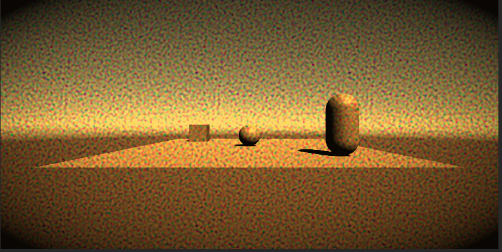
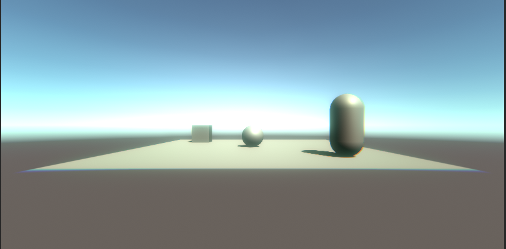

# ポストエフェクト

## PostProcessingScene
* 「Post Processing」のパッケージを使ってみよう
* 被写界深度以外のポストエフェクトを追加しよう

## SelfPostEffectScene
* 1パスの平均フィルタを実装してみよう
* サンプリング数を増やしてみよう
* 2パスのガウシアンフィルタを実装してみよう
* 輝度が高い領域を抽出してガウシアンフィルタを適応し、最前面に重ねてグレアにしてみよう

# 自分なりに変更した点

- 追加したポストエフェクト：[追加したエフェクトをここに記述]
-Bloom・Chromatic Aberration・Color Grading・Grain・Vignette
-各エフェクトを個別にプレハブ化しレイヤー分けしたのでPostProcessLayerで複数の組み合わせを自由に可能にした。
-組み合わせ次第でレトロテレビのような外観にしたり、ビーチの海の照り返しのような青白く色がずれる外観を作れるようになっている。(画像参照)

# 進め方

- 本リポジトリをフォークしてください
- フォークしたリポジトリをcloneします
- Unityのプロジェクトを更新して実装してください。
- このテキストファイルに変更点を記載してください
- result.gifを自分の結果を保存して差し替えてください
- プルリクエストを出して提出してください
